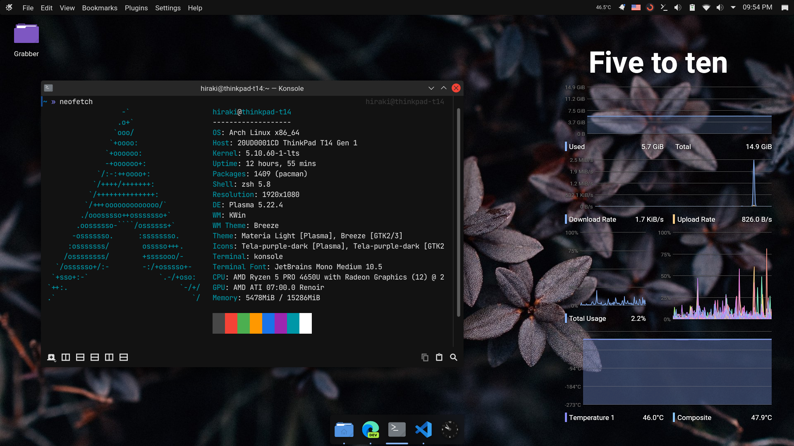

  <h1> Hùng Ngọc Phát </h1> 
  <h3>雄鈺発 - Takeda Hiraki</h3>
  <h4>Machine Learning/Data Engineer Student.</h4>
   
  
   
  

 

## 👩‍💻 Programming Languages
| Task                        | Languages                       |
|--------------------------   |---------------------------------|
| 📈 DS/Machine learning          | Python 3, MATLAB                |
| 📱 Mobile app development    | Dart (Flutter)                  |
| 📠 Backend Development      | Javascript (Node.js)                  |
| 🗃️ Database management       | TransactSQL, SQLite, PostgreSQL |
| 📝 Documenting               | LaTeX, Markdown                |
| 🖥️ Workflow automation       | Linux shell scripting (bash/zsh)|

## 💻 Techy details
- Laptop: ThinkPad T14 Gen 1 (AMD).
- Operating system: Been using GNU/Linux as main OS for 3 years (Arch - openSUSE).
- Favourite OS: Apple macOS (for its good-looking UI, stability, POSIX compatibility, and the abundance of industrial standard software. Comprises of advantages from both Linux and Windows). You can see my Hackintosh repository for my old laptop [here](https://github.com/hungngocphat01/OpenCore-Thinkpad-T430s).

## 🏫 Education
- High school: Quoc Hoc Quy Nhon
- Bachelor: Computer Science @ University of Science, Ho Chi Minh.

## 📚 Languages
- English: IELTS 7.0 (mock test held by Yola + IDP Vietnam in 2019). 
- Japanese: N4 equivalent. No intention of taking the real test.
- Kinh language: native.

## 🎹 Interests
- Doing weeb things.
- History.
- Japanese language.
- Old Vietnamese writing system (Hán-Nôm).

**Why a Japanese alias?**  
I'm sure that every person in the M-A (manga-anime) community thinks it's cool to have a Japanese alias. My alias is created based on the transliteration of my real name from Modern Vietnamese (Latin alphabet) to Middle Vietnamese (scripted in Hán-tự, the Vietnamese variant of the Kanji/Hanja/Hanzi family). As a result, it can also be pronounced in Japanese. This is definitely a linguistically legit weeb alias.
